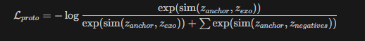

1.输入数据：
Anchor Mask (交互部件): 指示特定的交互区域（如“杯把”）。
Whole Object Mask (完整物体): 指示物体所在的完整矩形区域（如“整个杯子”）。
Exocentric Mask (第三人称物体): 提供跨视角的正样本一致性。
2.构造负样本
Easy Negative (环境背景 - Environment):
定义: Logically Background
计算逻辑: 1 - Whole_Object_Mask
语义: 包含桌子、墙壁等与物体完全无关的区域。
作用: 防止模型关注图像背景。

Hard Negative (物体非交互部分 - Object Body):
定义: Logically Object_Body
计算逻辑: Whole_Object_Mask - Interaction_Part_Mask
语义: 属于物体本身但只有物理支撑作用、没有发生交互的区域（例如“杯身”相对于“杯把”）。
作用: 这是最核心的改进。迫使模型学习极细粒度的特征，区分纹理相似的“部件”与“主体”。

3.损失计算 (Loss Calculation)
最终的损失函数基于 InfoNCE Loss 形式计算：

